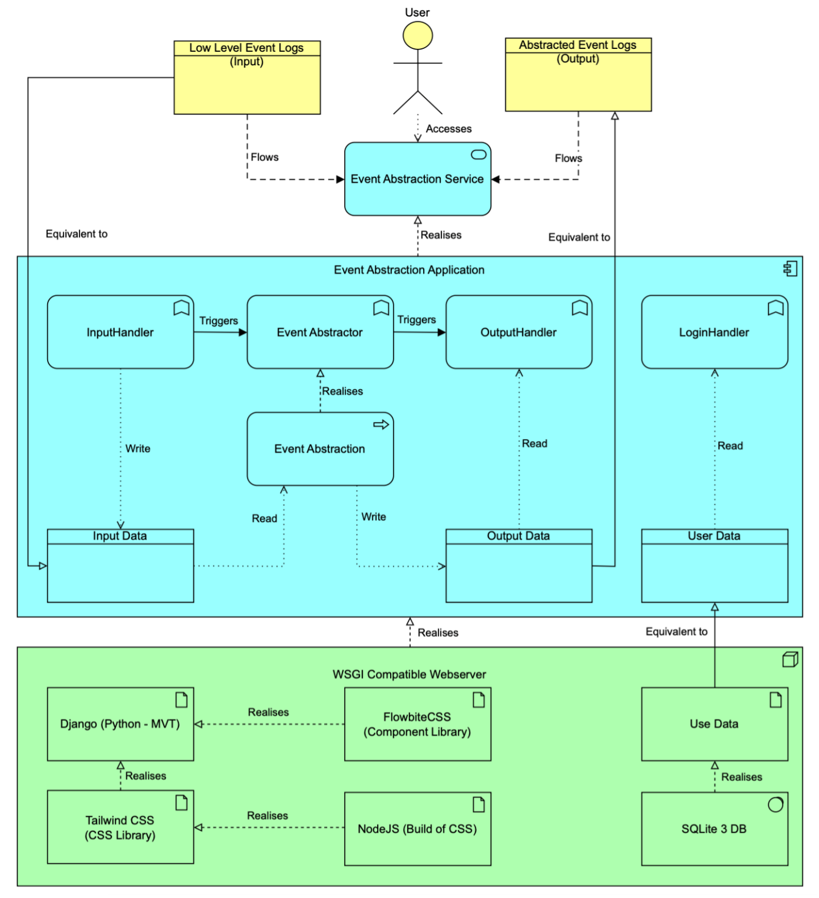

# Event Abstraction for Process Mining in Robotics

## Table of Contents
1. [Introduction](#1-introduction)
2. [Software Architecture](#2-software-architecture)
3. [Getting Started](#3-getting-started)
4. [Usage](#4-usage)
5. [Future Work](#5-future-work)
6. [Licensing](#6-licensing)
7. [Contacts](#7-contacts)


## 1) Introduction
### 1.1 Project Description
The main goal of this project is to develop a tool (in the form of a webapp) to transform robotic raw sensor data (aka. low-level events) - such as position, velocity, or status information - into meaningful events (aka. high-level events) that support informed decision-making in robotic applications.

The project leverages the TALE (Tag-Based Multi-Perspective Methodology) dataset, specifically designed for robotic smart agriculture scenarios.

### 1.2 Processing Approach
--> LUKAS, short description of processing approach, including data preprocessing, evtl. Dynamic view hier rein? Wenn du eine Grafik einfügst, bitte Nummerierung meiner Grafik unten und allenfalls auch Referenzen anpassen.

## 2) Software Architecture
### 2.1) Architecture & Components
The proposed software architecture utilises the business (yellow), application (blue), and technology (green) layers from Archimate 3.1. As no parts were supplied beforehand, all elements were implemented from scratch. Furthermore, it must be mentioned that the focus of the solution lies on the event abstractor application service and event abstraction application process.
A detailed explanation of the three different layers and their components within is described briefly subsequently:

### Business Layer
Within the business layer, the following elements are to be considered:
- **Low-Level Event Logs (Input)**: Representing the low-level event log data (tale format), which is used as the input data for event abstraction.
- **Abstracted Event Logs (Output)**: Comprising the abstracted low-level event log data.
- **User**: Representing the user interested in abstracting low-level event log data via accessing the event abstraction application service.

### Application Layer
Within the application layer, the subsequent elements are noteworthy to be mentioned:
- **Event Abstraction Application**: Application component, realizing the event abstraction application service. It contains all subsequent elements and is realized by the WSGI-compatible webserver.
- **Login Handler**: The application service responsible for authenticating users interested in accessing the event abstraction application service based on the available user data and provided user credentials.
- **Input Handler**: The application responsible for receiving low-level event logs and storing them in the local filesystem for further processing.
- **Event Abstractor**: Application service, which, based on the input data, performs the event abstraction.
- **Event Abstraction**: The Application process realizes the event abstractor.
- **Output Handler**: The application service provides the abstracted event logs. The service offers additional application logic necessary for navigating through the event abstraction.

### Technology Layer
Within the technology layer, the following elements are vital:
- **WSGI compatible web server**: Responsible for acting as an interface between the Python web application and the web server via handling HTTP requests and invoking the WSGI application. It contains all subsequent elements.
- **Django (Python – MVT)**: High-level Python full-stack web framework used for developing the provided web application.
- **Flowbite**: Component library that works with Tailwind CSS and JavaScript, used to implement the graphical user interface of the presented web application.
- **Node.js**: A cross-platform JavaScript runtime environment used to manage dependencies via NPM and to process Tailwind CSS during the build step.
- **SQLite3 DB & User Data**: User data, necessary for the login handler persisted within an SQLite 3 database.

The graphical representation of the presented architecture and the interactions between the different layers/components can be found in the Figure 01 below:

*Figure 01: Software Architecture*

### 2.2) Technologies used
To implement the Event Abstraction for Process Mining in Robotics, the following technology stack is used:

[]()[]()[](https://flowbite.com/)[]()[]()[]()[]()[]()


## 3) Getting Started
All commands outlined in this chapter must be run from the root directory of this project, otherwise adapt them accordingly.

### 3.1) Prerequisites
Ensure that the following requirements are met:
- Installed [Python v3.13](https://www.python.org/downloads/release/python-3130)
- (Optional, but highly recommended) A Python virtual environment (venv). To do so, proceed as follows:
    1. Create the Python virtual environment named venv:
        ```bash
        python3.13 -m venv venv
        ```
    2. Activate the virtual environment and make sure it has been activated correctly :
        ```bash
        source venv/bin/activate
        which python3.13 && which pip3.13
        # Ensure, the following ouput is returned to check for correct activation:
        # ./venv/bin/python3.13
        # ./venv/bin/pip3.13
        ```
- Required Python dependencies:
    1. Install the required dependencies:
        ```bash
        python3.13 -m pip install -r requirements.txt
        ```

### 3.2) Prepare and run Django
1. Apply the Django migrations (create database schema):
    ```bash
    python3.13 manage.py migrate
    ```
2. Create a test user, necessary for authentication:
    ```bash
    python3.13 manage.py shell

    from django.contrib.auth.models import User

    User.objects.create_user(username='user', email='testuser@example.com', password='user')
    ```
    If successful, leave the Django management shell (ctrl + d).
3. Start the webserver:
    ```bash
    python3.13 manage.py runserver
    ```
    If successful, access the app under http://localhost:8000/app/

## 4) Usage
Once the steps outlined in sections [3.1](#31-prerequisites)-[3.2](#32-prepare-and-run-django) have been successfully completed, the webapp can be utilised. Please use the following URLs to access the relevant components:
- Webapp: http://localhost:8000/app/

To transform raw data (aka. low-level events) into meaningful events (aka. high-level events), follow the subsequent steps:
1. Navigate to the webapp GUI -> log in with the credentials defined in section [3.2](#32-prepare-and-run-django)
2. Select the raw data (TALE dataset, .zip format) by selecting the desired file via explorer or using drag and drop. Upload.
3. Be patient - it may take some time to process the data. Once it has been processed, there are three ways to proceed:
    - Download File: Download the result of the data transformation (.csv)
    - Proces another File: Perform further processing
    - Log out: Self-explanatory

An overview of the points described above is provided by the following recording:
<div align="center">
  
</div>

## 5) Future Work
### 5.1 Processing-Pipeline-Related Suggestions/Improvements
-> LUKAS
- **Suggestion/Improvement 01**: XXXX

### 5.2 Infrastructure-Related Suggestions/Improvements
- **Suggestion/Improvement 01**: Considering a stable production environment, a production-ready web server (e.g., Gunicorn, multiple process, multiple threads) must be used.
- **Suggestion/Improvement 02**: A more reliable and scalable database system, such as PostgreSQL, should be used for production deployment to ensure better performance, concurrency handling, and data integrity.
- **Suggestion/Improvement 03**: In addition to implementing a production-capable RDBMS like PostgreSQL, the integration of a NoSQL database like MongoDB for efficient, performant, scalable, and user-related file handling is highly recommended. The NoSQL database eliminates the requirement of handling files in a separate directory within the project root directory and directly handles files on the database level. A NoSQL database would also improve performance when searching files if the system grows.
- **Suggestion/Improvement 04**: By integrating Celery/Celery Workers into the solution, offloading of processing tasks can be facilitated, enabling asynchronous execution and substantial enhancement of the user experience. Implementing web sockets (via an ASGI-compatible web server) could round off our provided solution. Furthermore, a scalable message broker like RabbitMQ with persistent storage is recommended. The message broker enables the web server to submit the raw event data to a message queue. A concurrent task realized with Celery consumes waits for messages with raw event data and submits them to the event abstraction model. After the model returns the output, the Celery task updates the web sockets.

## 6) Licensing
The DCF is available under the MIT [license](./LICENSE).

## 7) Contacts
- **Arbnor Bekiri**, arbnor.bekiri@students.fhnw.ch
- **Christian Bieri**, christian.bieri@students.fhnw.ch
- **Samuel Hilty**, samuel.hilty@students.fhnw.ch
- **Leandro Hoenen**, leandro.hoenen@students.fhnw.ch
- **Lukas Jakober**, lukas.jakober@students.fhnw.ch